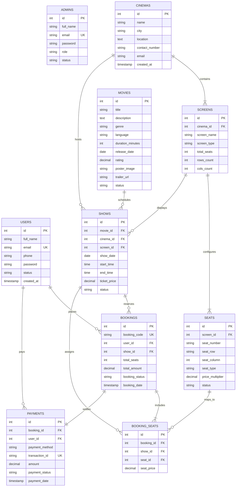

# Movie Booking System - Database Design & ER Diagram (Phase 2)

## 1. Overview
This document outlines the relational database architecture for the **CinePass Movie Booking System**. The database schema is engineered in **MySQL / MariaDB** (compatible with XAMPP) using the **InnoDB** storage engine to support ACID transactions, row-level locking, and foreign key integrity.

- **Database Name:** `movie_booking_db`
- **SQL Script:** `database/movie_booking.sql`

---

## 2. Entity-Relationship (ER) Diagram



---

## 3. Core Business Workflow & Data Flow

```text
┌──────────────┐
│    Movie     │  (e.g., Oppenheimer, Dune 2)
└──────┬───────┘
       │  (1 : N)
       ▼
┌──────────────┐
│     Show     │  (Assigned to Movie + Cinema + Screen + Date & Time)
└──────┬───────┘
       │  (N : 1)
       ▼
┌──────────────┐
│    Screen    │  (Physical auditorium inside a Cinema branch)
└──────┬───────┘
       │  (1 : N)
       ▼
┌──────────────┐
│    Seats     │  (A1, A2, B1... with Standard, Premium, VIP tiers)
└──────┬───────┘
       │  (Selected by User)
       ▼
┌──────────────┐
│   Booking    │  (Cart / Reservation created with unique booking code)
└──────┬───────┘
       │  (1 : 1)
       ▼
┌──────────────┐
│   Payment    │  (Confirmed transaction via Cash, Card, EasyPaisa, JazzCash)
└──────────────┘
```

---

## 4. Table Dictionaries & Schema Specs

### 1. `users`
Stores registered customer accounts who reserve tickets online.
* **PK:** `id` (INT, AUTO_INCREMENT)
* **Unique:** `email` (VARCHAR(150))
* **Fields:** `full_name`, `email`, `phone`, `password` (bcrypt), `status` (active/inactive), `created_at`, `updated_at`.

### 2. `admins`
Stores cinema administration, operations managers, and box-office cashiers.
* **PK:** `id` (INT, AUTO_INCREMENT)
* **Unique:** `email` (VARCHAR(150))
* **Fields:** `full_name`, `email`, `password` (bcrypt), `role` (superadmin/manager/cashier), `status`, `created_at`, `updated_at`.

### 3. `cinemas`
Stores cinema branch locations and contact details.
* **PK:** `id` (INT, AUTO_INCREMENT)
* **Fields:** `name`, `city`, `location`, `contact_number`, `email`, `created_at`.

### 4. `screens`
Stores auditoriums / halls within each cinema.
* **PK:** `id` (INT, AUTO_INCREMENT)
* **FK:** `cinema_id` $\rightarrow$ `cinemas(id)` ON DELETE CASCADE
* **Fields:** `screen_name`, `screen_type` (2D, 3D, IMAX, 4DX), `total_seats`, `rows_count`, `cols_count`.

### 5. `movies`
Stores movie information, trailers, posters, genres, and showing status.
* **PK:** `id` (INT, AUTO_INCREMENT)
* **Fields:** `title`, `description`, `genre`, `language`, `duration_minutes`, `release_date`, `rating`, `poster_image`, `trailer_url`, `status` (now_showing, upcoming, archived).

### 6. `shows`
Links a Movie to a Cinema and a Screen for a specific calendar date and time.
* **PK:** `id` (INT, AUTO_INCREMENT)
* **FKs:** 
  * `movie_id` $\rightarrow$ `movies(id)` ON DELETE CASCADE
  * `cinema_id` $\rightarrow$ `cinemas(id)` ON DELETE CASCADE
  * `screen_id` $\rightarrow$ `screens(id)` ON DELETE CASCADE
* **Fields:** `show_date`, `start_time`, `end_time`, `ticket_price`, `status` (scheduled, ongoing, completed, cancelled).

### 7. `seats`
Individual seating units configured for a specific screen layout.
* **PK:** `id` (INT, AUTO_INCREMENT)
* **FK:** `screen_id` $\rightarrow$ `screens(id)` ON DELETE CASCADE
* **Unique:** `(screen_id, seat_number)`
* **Fields:** `seat_number` (e.g. A1, B5), `seat_row`, `seat_column`, `seat_type` (Standard, Premium, VIP), `price_multiplier`, `status` (active, under_maintenance).

### 8. `bookings`
Parent reservation ticket placed by a user for a specific show.
* **PK:** `id` (INT, AUTO_INCREMENT)
* **Unique:** `booking_code` (e.g. `CP-BK-202610-001`)
* **FKs:**
  * `user_id` $\rightarrow$ `users(id)` ON DELETE CASCADE
  * `show_id` $\rightarrow$ `shows(id)` ON DELETE CASCADE
* **Fields:** `total_seats`, `total_amount`, `booking_status` (pending, confirmed, cancelled), `booking_date`.

### 9. `booking_seats`
Junction table detailing each individual seat reserved within a booking.
* **PK:** `id` (INT, AUTO_INCREMENT)
* **FKs:**
  * `booking_id` $\rightarrow$ `bookings(id)` ON DELETE CASCADE
  * `show_id` $\rightarrow$ `shows(id)` ON DELETE CASCADE
  * `seat_id` $\rightarrow$ `seats(id)` ON DELETE CASCADE
* **Unique Index (Double-Booking Prevention):** `UNIQUE KEY (show_id, seat_id)`  
  *Prevents the same seat in the same showtime from ever being booked more than once!*
* **Fields:** `seat_price`.

### 10. `payments`
Financial transaction record for each completed booking.
* **PK:** `id` (INT, AUTO_INCREMENT)
* **Unique:** `booking_id`, `transaction_id`
* **FKs:**
  * `booking_id` $\rightarrow$ `bookings(id)` ON DELETE CASCADE
  * `user_id` $\rightarrow$ `users(id)` ON DELETE CASCADE
* **Fields:** `payment_method` (Cash, Debit/Credit Card, EasyPaisa, JazzCash), `transaction_id`, `amount`, `payment_status` (pending, completed, failed, refunded), `payment_date`.

---

## 5. Sample Data Seeded
Both [movie_booking.sql](file:///d:/Aptech%20Shahr-e-faisal/2nd%20Semester/Movie%20Booking%20System%202nd%20Semester%20Project/database/movie_booking.sql) and [schema.sql](file:///d:/Aptech%20Shahr-e-faisal/2nd%20Semester/Movie%20Booking%20System%202nd%20Semester%20Project/database/schema.sql) include pre-populated sample records:
* **Admins:** `admin@moviebooking.com` (pass: `admin123`) & Hall Manager
* **Users:** `user@example.com` (pass: `user123`), Sara Ahmed, Bilal Tariq
* **Cinemas:** Atrium Cinemas, Nueplex DHA, Cinepax Ocean Mall
* **Screens:** Gold, Silver, Royal IMAX, Platinum Screen
* **Movies:** Oppenheimer, Dune: Part Two, Interstellar, Gladiator II
* **Shows:** Active daily show schedules with timings and pricing
* **Seats:** Complete 30-seat layout per screen across Standard, Premium & VIP rows
* **Bookings & Payments:** Realistic booking entries and transaction records
