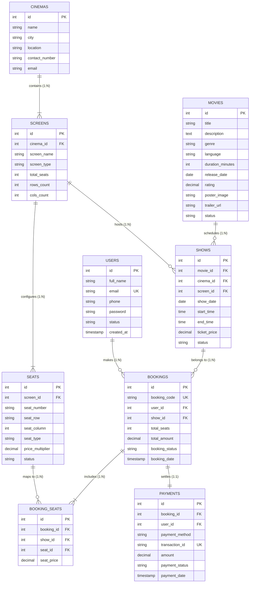

# Phase 22 — ER Diagram & System Algorithms Documentation
**Project:** CinePass Movie Booking System  
**Course:** Aptech Semester 2 Web Development & Database Design  
**Date:** October 2026  

---

## 1. Entity-Relationship (ER) Architecture

The database architecture is designed with **referential integrity (Foreign Keys)**, **ON DELETE CASCADE** mechanisms, and **unique constraints** to prevent duplicate seat bookings and data corruption.

### Core Relational Chains:
1. **Customer Reservation Chain:**
   $$\text{User} \xrightarrow{\text{makes}} \text{Booking} \xrightarrow{\text{belongs to}} \text{Show} \xrightarrow{\text{shows}} \text{Movie}$$
2. **Cinema Auditorium Chain:**
   $$\text{Cinema} \xrightarrow{\text{contains}} \text{Screen} \xrightarrow{\text{hosts}} \text{Show} \xrightarrow{\text{reserves}} \text{Booking}$$

---

### Entity Relationship Diagram (Mermaid)



---

## 2. Core Relational Tables & Cardinality

| Relationship | Cardinality | Business Logic Rule |
|---|:---:|---|
| **User $\rightarrow$ Booking** | $1 : N$ | A registered user can create multiple bookings; each booking belongs to exactly one user. |
| **Booking $\rightarrow$ Show** | $N : 1$ | Multiple bookings can exist for a show; each booking is tied to one show. |
| **Show $\rightarrow$ Movie** | $N : 1$ | A movie can have many shows scheduled; each show displays one movie. |
| **Cinema $\rightarrow$ Screen** | $1 : N$ | A cinema multiplex contains multiple auditoriums (screens). |
| **Screen $\rightarrow$ Show** | $1 : N$ | A screen hosts multiple showtimes across dates and hours. |
| **Screen $\rightarrow$ Seats** | $1 : N$ | A screen has a fixed grid of physical seats (e.g. A1 to E6). |
| **Booking $\rightarrow$ Booking_Seats** | $1 : N$ | A booking reserves between 1 and 8 individual seats. |
| **Booking $\rightarrow$ Payment** | $1 : 1$ | Each booking is tied to exactly one simulated payment record. |

---

## 3. System Algorithms

---

### Algorithm 1: User Login Algorithm

* **Objective:** Authenticate user credentials securely, prevent session fixation, and establish role-based access.
* **Input:** `email` (string), `password` (string).
* **Output:** Authenticated user session or error message.

```text
Algorithm: User_Login(email, password)
---------------------------------------
1. START
2. Sanitize and trim email and password.
3. Validate email format using filter_var(email, FILTER_VALIDATE_EMAIL).
   IF email format is invalid THEN:
       RETURN Error("Invalid email format").
   END IF
4. Query database using PDO Prepared Statement:
   STMT = DB.prepare("SELECT * FROM users WHERE email = ? LIMIT 1")
   STMT.execute([email])
   USER = STMT.fetch()
5. IF USER does not exist THEN:
       RETURN Error("Invalid email address or password").
   END IF
6. Verify password hash using BCRYPT:
   IF password_verify(password, USER.password) == TRUE THEN:
       IF USER.status != 'active' THEN:
           RETURN Error("Account deactivated. Contact cinema administration").
       END IF
       // Prevent Session Fixation
       CALL session_regenerate_id(true)
       SET $_SESSION['user_id']    = USER.id
       SET $_SESSION['user_name']  = USER.full_name
       SET $_SESSION['user_email'] = USER.email
       SET $_SESSION['user_role']  = 'user'
       IF $_SESSION['redirect_url'] is set THEN:
           REDIRECT to $_SESSION['redirect_url']
       ELSE:
           REDIRECT to 'dashboard.php'
       END IF
   ELSE:
       RETURN Error("Invalid email address or password").
   END IF
7. END
```

---

### Algorithm 2: Movie Search & Filter Algorithm

* **Objective:** Query movie catalog by keyword, genre, language, cinema, and release date.
* **Input:** `search_term` (string), `genre` (string), `status` (string), `cinema_id` (int), `date` (date string).
* **Output:** Array of matching movie records.

```text
Algorithm: Movie_Search_And_Filter(search_term, genre, status, cinema_id, date)
--------------------------------------------------------------------------------
1. START
2. Initialize SQL = "SELECT DISTINCT m.* FROM movies m"
   Initialize CONDITIONS = []
   Initialize PARAMS = []
3. IF cinema_id > 0 OR date IS NOT EMPTY THEN:
       SQL = SQL + " JOIN shows s ON m.id = s.movie_id"
   END IF
4. IF search_term IS NOT EMPTY THEN:
       CONDITIONS.append("(m.title LIKE ? OR m.genre LIKE ? OR m.language LIKE ?)")
       PARAMS.append("%" + search_term + "%")
       PARAMS.append("%" + search_term + "%")
       PARAMS.append("%" + search_term + "%")
   END IF
5. IF genre IS NOT EMPTY THEN:
       CONDITIONS.append("m.genre LIKE ?")
       PARAMS.append("%" + genre + "%")
   END IF
6. IF status IS NOT EMPTY THEN:
       CONDITIONS.append("m.status = ?")
       PARAMS.append(status)
   END IF
7. IF cinema_id > 0 THEN:
       CONDITIONS.append("s.cinema_id = ?")
       PARAMS.append(cinema_id)
   END IF
8. IF date IS NOT EMPTY THEN:
       CONDITIONS.append("s.show_date = ?")
       PARAMS.append(date)
   END IF
9. IF CONDITIONS is not empty THEN:
       SQL = SQL + " WHERE " + JOIN(CONDITIONS, " AND ")
   END IF
10. SQL = SQL + " ORDER BY m.release_date DESC"
11. STMT = DB.prepare(SQL)
12. STMT.execute(PARAMS)
13. MOVIES = STMT.fetchAll()
14. RETURN MOVIES
15. END
```

---

### Algorithm 3: Seat Availability Algorithm

* **Objective:** Calculate available, booked, and maintenance seats for a specific showtime.
* **Input:** `show_id` (integer).
* **Output:** Grid of seats with real-time status (`available`, `booked`, `under_maintenance`).

```text
Algorithm: Get_Seat_Availability(show_id)
-----------------------------------------
1. START
2. Retrieve Show record:
   SHOW = DB.prepare("SELECT * FROM shows WHERE id = ?").execute([show_id]).fetch()
   IF SHOW is null THEN:
       RETURN Error("Show not found")
   END IF
3. Fetch all physical seats configured for this auditorium:
   ALL_SEATS = DB.prepare(
       "SELECT * FROM seats WHERE screen_id = ? ORDER BY seat_row ASC, seat_column ASC"
   ).execute([SHOW.screen_id]).fetchAll()
4. Fetch IDs of all seats reserved in active/confirmed bookings:
   BOOKED_SEAT_IDS = DB.prepare("
       SELECT bs.seat_id 
       FROM booking_seats bs 
       JOIN bookings b ON bs.booking_id = b.id 
       WHERE bs.show_id = ? AND b.booking_status != 'cancelled'
   ").execute([show_id]).fetchAllColumn()
5. FOR EACH seat IN ALL_SEATS:
       IF seat.id IN BOOKED_SEAT_IDS THEN:
           seat.ui_status = "status-booked"
           seat.is_selectable = FALSE
       ELSE IF seat.status == 'under_maintenance' THEN:
           seat.ui_status = "status-maintenance"
           seat.is_selectable = FALSE
       ELSE:
           seat.ui_status = "status-available"
           seat.is_selectable = TRUE
       END IF
       // Calculate price with multiplier
       seat.price = ROUND(SHOW.ticket_price * seat.price_multiplier)
   END FOR
6. Group seats by seat_row (Row A, Row B, Row C...)
7. RETURN Grouped_Seats
8. END
```

---

### Algorithm 4: Booking Reservation Algorithm (ACID Transaction)

* **Objective:** Reserve seats atomically, prevent double-booking collisions, generate unique voucher code, and calculate order total.
* **Input:** `user_id` (int), `show_id` (int), `selected_seat_ids` (array of integers), `payment_method` (string).
* **Output:** Created Booking ID & Booking Code or rollback on collision.

```text
Algorithm: Create_Booking_Transaction(user_id, show_id, selected_seat_ids, payment_method)
------------------------------------------------------------------------------------------
1. START
2. Validate seat selection:
   IF selected_seat_ids is empty THEN:
       RETURN Error("Please select at least 1 seat")
   END IF
   IF count(selected_seat_ids) > 8 THEN:
       RETURN Error("Maximum 8 seats allowed per booking")
   END IF
3. BEGIN TRANSACTION (DB.beginTransaction())
4. // Concurrency Check: Check if any of selected seats were just booked
   PLACEHOLDERS = Repeat '?' count(selected_seat_ids) times
   QUERY = "SELECT seat_id FROM booking_seats bs JOIN bookings b ON bs.booking_id = b.id 
            WHERE bs.show_id = ? AND bs.seat_id IN (" + PLACEHOLDERS + ") AND b.booking_status != 'cancelled'"
   CONFLICT_STMT = DB.prepare(QUERY)
   CONFLICT_STMT.execute([show_id, ...selected_seat_ids])
   CONFLICTS = CONFLICT_STMT.fetchAll()
   
   IF count(CONFLICTS) > 0 THEN:
       DB.rollBack()
       RETURN Error("One or more selected seats are no longer available. Please select other seats.")
   END IF

5. Fetch Show & Seat Pricing:
   SHOW = DB.prepare("SELECT ticket_price FROM shows WHERE id = ?").execute([show_id]).fetch()
   SEATS = DB.prepare("SELECT id, price_multiplier FROM seats WHERE id IN (...)").execute(selected_seat_ids)
   
   TOTAL_AMOUNT = 0
   FOR EACH seat IN SEATS:
       SEAT_PRICE = ROUND(SHOW.ticket_price * seat.price_multiplier)
       TOTAL_AMOUNT = TOTAL_AMOUNT + SEAT_PRICE
   END FOR

6. Generate Unique Alphanumeric Booking Code:
   BOOKING_CODE = "CP-" + UPPER(SUBSTRING(MD5(UNIQID()), 0, 8))

7. Insert Parent Booking:
   BK_STMT = DB.prepare("
       INSERT INTO bookings (booking_code, user_id, show_id, total_seats, total_amount, booking_status, booking_date) 
       VALUES (?, ?, ?, ?, ?, 'confirmed', NOW())
   ")
   BK_STMT.execute([BOOKING_CODE, user_id, show_id, count(selected_seat_ids), TOTAL_AMOUNT])
   BOOKING_ID = DB.lastInsertId()

8. Insert Each Reserved Seat into junction table:
   FOR EACH seat IN SEATS:
       SEAT_PRICE = ROUND(SHOW.ticket_price * seat.price_multiplier)
       DB.prepare("
           INSERT INTO booking_seats (booking_id, show_id, seat_id, seat_price) 
           VALUES (?, ?, ?, ?)
       ").execute([BOOKING_ID, show_id, seat.id, SEAT_PRICE])
   END FOR

9. COMMIT TRANSACTION (DB.commit())
10. RETURN { status: "SUCCESS", booking_id: BOOKING_ID, booking_code: BOOKING_CODE }
11. ON EXCEPTION:
        DB.rollBack()
        RETURN Error("Booking failed due to transaction error.")
12. END
```

---

### Algorithm 5: Payment Processing Algorithm

* **Objective:** Validate supported payment channel, simulate transaction settlement without saving sensitive card numbers, and issue ticket vouchers.
* **Input:** `booking_id` (int), `user_id` (int), `payment_method` (string), `payment_details` (array).
* **Output:** Payment confirmation & issuance of digital admission voucher.

```text
Algorithm: Process_Simulated_Payment(booking_id, user_id, payment_method, payment_details)
------------------------------------------------------------------------------------------
1. START
2. ALLOWED_METHODS = ["Cash", "Debit/Credit Card", "EasyPaisa", "JazzCash"]
3. IF payment_method NOT IN ALLOWED_METHODS THEN:
       RETURN Error("Invalid or unsupported payment channel")
   END IF
4. Fetch Booking Record:
   BOOKING = DB.prepare("SELECT * FROM bookings WHERE id = ? AND user_id = ?").execute([booking_id, user_id]).fetch()
   IF BOOKING is null THEN:
       RETURN Error("Booking record not found")
   END IF
5. Generate Unique Transaction Reference ID:
   TXN_ID = "TXN-" + UPPER(payment_method[0..3]) + "-" + UPPER(SUBSTRING(SHA1(UNIQID() + booking_id), 0, 10))
6. Insert Payment Record into `payments` table:
   // NOTE: Real card numbers or CVV are never stored in compliance with PCI-DSS guidelines!
   PAY_STMT = DB.prepare("
       INSERT INTO payments (booking_id, user_id, payment_method, transaction_id, amount, payment_status, payment_date) 
       VALUES (?, ?, ?, ?, ?, 'completed', NOW())
   ")
   PAY_STMT.execute([booking_id, user_id, payment_method, TXN_ID, BOOKING.total_amount])
7. Update Booking Status:
   DB.prepare("UPDATE bookings SET booking_status = 'confirmed' WHERE id = ?").execute([booking_id])
8. Construct Ticket Pass Voucher with scannable QR Code payload:
   QR_PAYLOAD = "CINEPASS|" + BOOKING.booking_code + "|" + TXN_ID + "|TOTAL:" + BOOKING.total_amount
9. SET Flash Notification: "Payment verified! Your booking voucher has been issued."
10. REDIRECT to "booking-success.php?id=" + booking_id
11. END
```
