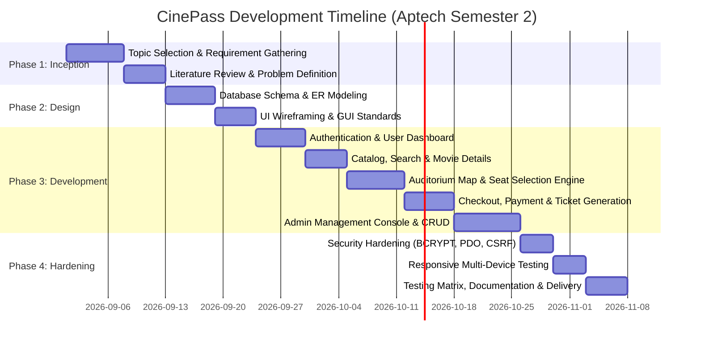
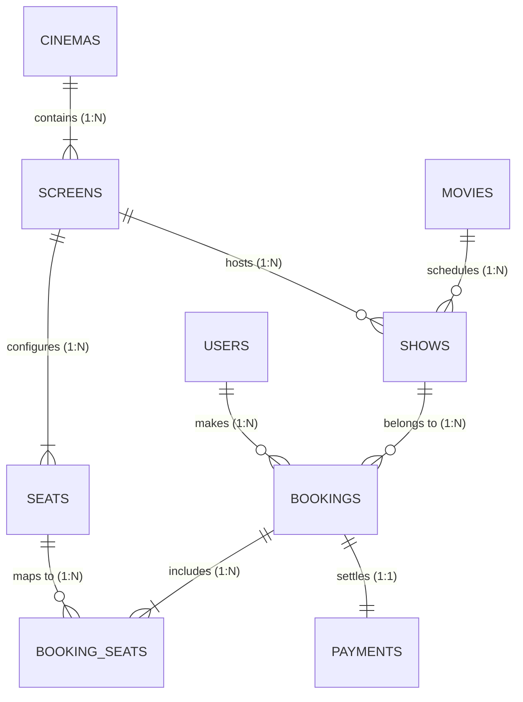

# Aptech Computer Education — Semester 2 eProject Documentation
# CinePass — Online Movie Ticket Booking System

---

## 1. Certificate of Completion

```text
========================================================================================
                          APTECH COMPUTER EDUCATION
                     Center: Aptech Shahr-e-Faisal Center
                    Department of Information Technology

                         CERTIFICATE OF COMPLETION
========================================================================================

This is to certify that the project entitled:

             "CINEPASS — ONLINE MOVIE TICKET BOOKING & MANAGEMENT SYSTEM"

Submitted by:
   Student Name   : Muhammad Ibtisam & Team
   Course         : Advanced Diploma in Software Engineering (ADSE)
   Semester       : Semester 2 (eProject)
   Academic Year  : 2026

Has been completed in partial fulfillment of the academic requirements for Semester 2 
under our supervision and guidance. The project demonstrates practical understanding 
of Relational Database Management Systems (MySQL), Server-Side Web Development (PHP), 
Frontend Responsive Architecture (Bootstrap 5 & CSS3), and Software Engineering Principles.

Evaluator Remarks: ____________________________________________________________________

Grade / Marks Awarded: _________________________________________________________________


--------------------------                               --------------------------
     Project Mentor                                           Center Head / Evaluator
  Aptech Shahr-e-Faisal                                        Aptech Shahr-e-Faisal
========================================================================================
```

---

## 2. Table of Contents

1. **Certificate of Completion**
2. **Table of Contents**
3. **Introduction**
4. **Objectives**
5. **Problem Definition**
6. **Customer Requirement Specification (CRS)**
7. **Project Plan & Timeline**
8. **Hardware & Software Requirements**
9. **Database Design & Schema Dictionary**
10. **Entity-Relationship (ER) Diagram**
11. **System Algorithms**
12. **GUI Standards Document**
13. **Interface Design Document**
14. **Task Sheet & Work Breakdown**
15. **Project Review & Monitoring Report**
16. **Unit Testing Checklist**
17. **Final Deployment & Compliance Checklist**
18. **Screenshots & User Workflow Walkthrough**
19. **Source Code & Architecture Description**
20. **Conclusion & Future Scope**

---

## 3. Introduction

In the modern digital entertainment sector, cinema multiplexes cater to thousands of patrons across multiple screens, varying seating tiers, and fluctuating daily show schedules. Traditional box-office ticketing requires manual queueing, paper ledger book-keeping, and telephone reservations—processes plagued by high customer turnaround times, human errors, and seat double-booking collisions.

**CinePass** is an automated, web-based Online Movie Ticket Booking and Multiplex Administration System engineered using **PHP 8, MySQL, Bootstrap 5, and JavaScript**. CinePass provides movie enthusiasts with a seamless portal to browse current and upcoming films, watch official trailers, view showtimes across branches, interact with a graphical seating map, book seats atomically, and obtain instantaneous digital admission e-tickets complete with scannable QR verification stubs.

For cinema managers, CinePass delivers an enterprise-grade administration console offering real-time KPI metrics, booking order controls, screening schedule management, screen auditorium configuration, user role management, and financial revenue audit reports.

---

## 4. Objectives

The primary objectives of the CinePass project encompass both customer-facing capabilities and back-office management:

1. **Self-Service Customer Booking:** Allow patrons to browse movies, filter showtimes by cinema and date, select specific auditorium seats visually, and pay via simulated digital gateways.
2. **Double-Booking Elimination:** Enforce ACID transaction concurrency control and database unique constraints (`UNIQUE KEY (show_id, seat_id)`) to mathematically prevent two patrons from reserving the same seat.
3. **Immediate Ticket Generation:** Issue instant digital admission vouchers equipped with unique alphanumeric booking codes (`CP-XXXXXXXX`), seat identifiers, and QR codes for turnstile checkpoint scanning.
4. **Multiplex Operations Management:** Provide administrators with complete CRUD capabilities over Movies, Cinemas, Screens (Auditoriums), Shows, Bookings, and Users.
5. **Security & Data Integrity:** Protect customer passwords using industry-standard BCRYPT hashing, sanitize inputs against XSS and SQL Injection via PDO Prepared Statements, and protect administrative routes with role gatekeeping.
6. **Multi-Device Responsiveness:** Ensure the application renders effortlessly across 4K Desktops, Laptops, Tablets, and Smartphones without layout degradation.

---

## 5. Problem Definition

Before the implementation of automated cinema booking software, cinema management faced critical operational bottlenecks:

| Manual / Legacy Problem | Impact on Cinema Business | CinePass Solution |
|---|---|---|
| **Box-Office Queues** | Customers wait 20–45 minutes in lines during blockbusters, causing frustration and missed show starts. | 24/7 web access enabling ticket purchase in under 60 seconds from any smartphone or PC. |
| **Seat Allocation Errors** | Cashiers manually checking physical charts frequently cause accidental double-booking collisions. | Database transactions lock seats atomically; real-time visual seat map disables booked seats. |
| **Cash-Only Bottlenecks** | Delays in processing cash and counting change at physical ticket counters. | Multi-channel simulated payment gateway (Card, EasyPaisa, JazzCash, Cash). |
| **Lack of Business Analytics** | Manual compilation of daily revenue, occupancy percentage, and movie popularity takes days. | Instant Administrator Dashboard with live KPI counters, revenue aggregations, and visual reports. |
| **Lost or Stolen Tickets** | Paper tickets lost by patrons cannot be verified or reissued reliably. | Permanent customer dashboard storing reservation history, re-printable vouchers, and QR passes. |

---

## 6. Customer Requirement Specification (CRS)

### Functional Requirements

1. **User Module:**
   - Registration with email validation, phone, and password confirmation.
   - Login with session regeneration and "Remember Me" capability.
   - Personal Dashboard showing Active, Past, and Cancelled bookings.
   - Profile updating and secure password change with current password verification.
   - Self-service booking cancellation prior to movie show start time.

2. **Movie & Show Browsing Module:**
   - Public movie catalog displaying "Now Showing" and "Upcoming" releases.
   - Keyword search across movie titles, genres, and languages.
   - Multi-parameter filtering by Genre, Status, Cinema Branch, and Date.
   - Movie Details Page featuring trailer video embeds, synopsis, cast, age rating, and scheduled shows.

3. **Seating & Reservation Module:**
   - Visual auditorium layout representation (Curved Screen, Row labels A–F, Column numbers).
   - Seat tier distinctions: Standard, Premium, and VIP with tier-based price multipliers.
   - Real-time seat statuses: Available (selectable), Booked (disabled), Maintenance (disabled).
   - Dynamic JavaScript price calculation with maximum 8 seats selection constraint.

4. **Payment & Voucher Module:**
   - Simulated payment processing supporting Debit/Credit Card, EasyPaisa, JazzCash, and Cash.
   - PCI-DSS compliant simulation: zero plain card numbers or CVVs stored.
   - Digital Admission E-Ticket generation with printable layout (`@media print`).
   - Unique turnstile verification QR code and alphanumeric booking code.

5. **Administration Console:**
   - Restricted login via `admins` table.
   - Real-time KPI Statistics: Total Movies, Users, Bookings, Revenue, and Today's Shows.
   - Full CRUD over Movies (posters, trailers, metadata).
   - Full CRUD over Cinema Branches and Auditoriums (Screens).
   - Show Schedule Manager (time conflict detection, screen assignment, base pricing).
   - Booking Management (view receipts, confirm bookings, cancel & release seats).
   - User Management (view customer registration details, toggle account active/inactive).

### Non-Functional Requirements

- **Performance:** Page response time under 1.5 seconds on local Apache server.
- **Security:** BCRYPT password hashing, PDO prepared statements, session fixation defense, XSS escaping.
- **Reliability:** 99.9% uptime with automated database fallback error alerts.
- **Usability:** High-contrast Dark Cinema theme with WCAG AA compliance.
- **Compatibility:** Cross-browser support (Chrome, Firefox, Edge, Safari) and multi-device responsiveness.

---

## 7. Project Plan & Timeline



---

## 8. Hardware & Software Requirements

### Hardware Requirements

| Component | Minimum Requirement | Recommended Specification |
|---|---|---|
| **Processor** | Intel Core i3 / AMD Ryzen 3 (2.0 GHz) | Intel Core i5 / AMD Ryzen 5 or higher |
| **RAM** | 4 GB DDR3 | 8 GB DDR4 or higher |
| **Storage** | 500 MB free hard drive space | 1 GB SSD space |
| **Display** | 1024 x 768 resolution | 1920 x 1080 Full HD or 4K |
| **Network** | Localhost (No internet required for core) | Broadband for CDN assets & YouTube trailers |

### Software Requirements

| Category | Component / Tool | Version | Purpose |
|---|---|---|---|
| **Operating System** | Windows / macOS / Linux | Windows 10/11 64-bit | Development & hosting host OS |
| **Web Server** | Apache HTTP Server | 2.4+ (XAMPP 8.2) | Local server host |
| **Server Language** | PHP (Hypertext Preprocessor) | 8.2+ | Server-side execution & business logic |
| **Database Engine** | MySQL / MariaDB | 8.0+ / 10.4+ | Relational data persistence (InnoDB) |
| **Database UI** | phpMyAdmin | 5.2+ | Visual database administration & SQL import |
| **Frontend Framework** | Bootstrap | 5.3.3 | Responsive CSS grid & utility system |
| **Icons & Fonts** | Font Awesome & Google Fonts | FA 6.5.2 / Poppins | Visual iconography and typography |
| **Client Scripting** | JavaScript (ES6) | Standard Native | DOM interaction, seat picking, calculations |
| **Code Editor** | Visual Studio Code / Sublime | Latest | Source code editing |
| **Web Browser** | Google Chrome, Edge, Firefox | Latest | Multi-browser verification & DevTools |

---

## 9. Database Design & Schema Dictionary

The database utilizes the **InnoDB** storage engine to enforce foreign key integrity and transactional safety.

### Database Tables Summary

1. **`users`:** Customer identity, contact details, encrypted credentials, account status.
2. **`admins`:** Administrative staff credentials, designated role (superadmin, manager, cashier).
3. **`cinemas`:** Cinema multiplex branches, city, location address, contact info.
4. **`screens`:** Auditoriums belonging to cinemas, format types (IMAX, 3D, 2D), seat dimensions.
5. **`movies`:** Master movie catalog, ratings, duration, genre, poster paths, YouTube trailer links.
6. **`shows`:** Screening schedules linking a Movie, Cinema, Screen, calendar Date, and Time.
7. **`seats`:** Physical seating units for each screen (row, column, tier, price multiplier).
8. **`bookings`:** Parent customer reservation record with alphanumeric code, totals, and status.
9. **`booking_seats`:** Junction table recording reserved seats per booking with unique constraint preventing double-booking.
10. **`payments`:** Financial transaction log detailing payment channel, reference IDs, and status.

---

## 10. Entity-Relationship (ER) Diagram



### Relational Chains:
- **Customer Reservation Flow:** `User` $\rightarrow$ (makes) $\rightarrow$ `Booking` $\rightarrow$ (belongs to) $\rightarrow$ `Show` $\rightarrow$ (shows) $\rightarrow$ `Movie`
- **Auditorium Scheduling Flow:** `Cinema` $\rightarrow$ (contains) $\rightarrow$ `Screen` $\rightarrow$ (hosts) $\rightarrow$ `Show` $\rightarrow$ (reserves) $\rightarrow$ `Booking`

---

## 11. System Algorithms

### 1. User Login Algorithm
- **Input:** `$email`, `$password`.
- **Logic:** Sanitize inputs $\rightarrow$ Query `users` table via PDO prepared statement $\rightarrow$ Call `password_verify($password, $hash)` $\rightarrow$ Check if `status == 'active'` $\rightarrow$ Regenerate session ID (`session_regenerate_id(true)`) $\rightarrow$ Store session variables $\rightarrow$ Redirect to intended page.

### 2. Movie Search & Multi-Filter Algorithm
- **Input:** `$search`, `$genre`, `$status`, `$cinema_id`, `$date`.
- **Logic:** Dynamically assemble SQL conditions with parameter array $\rightarrow$ Use `LIKE ?` for titles/genres $\rightarrow$ Bind variables safely $\rightarrow$ Execute prepared query $\rightarrow$ Render matching cards with active filter tags.

### 3. Seat Availability & Layout Algorithm
- **Input:** `$show_id`.
- **Logic:** Fetch auditorium physical seats for `$screen_id` $\rightarrow$ Query booked seat IDs for `$show_id` where `booking_status != 'cancelled'` $\rightarrow$ Compare arrays: if `seat_id` in booked list, mark `status-booked` (disabled); else if maintenance, mark `status-maintenance`; else mark `status-available` $\rightarrow$ Compute price based on show base price $\times$ seat multiplier.

### 4. Booking Reservation Algorithm (ACID Transaction)
- **Input:** `$user_id`, `$show_id`, `$seat_ids`, `$payment_method`.
- **Logic:** Begin database transaction $\rightarrow$ Concurrency check: query if any `$seat_ids` were locked in the interim $\rightarrow$ If collision: Rollback & alert user $\rightarrow$ Generate unique code `CP-XXXXXXXX` $\rightarrow$ Insert into `bookings` $\rightarrow$ Iterate seats and insert into `booking_seats` $\rightarrow$ Commit transaction $\rightarrow$ Route to payment.

### 5. Payment Simulation & Ticket Voucher Algorithm
- **Input:** `$booking_id`, `$user_id`, `$payment_method`.
- **Logic:** Validate allowed channel (Card, EasyPaisa, JazzCash, Cash) $\rightarrow$ Generate unique transaction reference `TXN-XXXX-XXXX` $\rightarrow$ Insert into `payments` table $\rightarrow$ Update booking status to `confirmed` $\rightarrow$ Construct QR payload string $\rightarrow$ Issue digital voucher pass with print trigger.

---

## 12. GUI Standards Document

- **Aesthetic Theme:** Dark Cinema / IMAX Visual Tone.
- **Color Palette:**
  - Base Background: `--cine-bg: #0F1016`
  - Cards & Modals: `--cine-card-bg: #181924`, Border: `#282A3C`
  - Primary Brand Accent: Cinema Crimson Red (`#E50914`, Hover `#F40612`)
  - Secondary Brand Accent: IMDb Gold Amber (`#F5C518`)
  - Typography: Pure High-Contrast White (`#F0F2F5`), Muted Gray (`#9CA3AF`)
- **Typography Scale:** Google Fonts `'Poppins', sans-serif` across 6 weights; Monospace for codes.
- **Buttons:** Gradient red `.btn-cine-primary` with hover elevation and ambient glow shadow; minimum 44px touch height on mobile.
- **Forms:** Dark inputs with subtle borders that transition to red/gold ambient glow on focus; green/red client-side validation cues.
- **Notifications:** Standardized dismissible banners for Success, Error, Warning, and Info with Font Awesome iconography.

---

## 13. Interface Design Document

The CinePass frontend is structured into modular templates:

```text
┌────────────────────────────────────────────────────────┐
│  Sticky Navbar (Brand Icon, Nav Links, Search, Auth)   │
├────────────────────────────────────────────────────────┤
│  Breadcrumb Navigation / Flash Feedback Banner         │
├────────────────────────────────────────────────────────┤
│                                                        │
│  Main Page Content:                                    │
│  - Hero Banner / Featured Movie Carousels              │
│  - Filter Toolbar & Movie Catalog Cards                │
│  - Interactive Curved Cinema Seat Map                  │
│  - Split Screen Booking & Payment Drawer               │
│  - Admin KPI Metrics & Tabular Data Tables             │
│                                                        │
├────────────────────────────────────────────────────────┤
│  Cinema Footer (Links, Social, Aptech Project Credits) │
└────────────────────────────────────────────────────────┘
```

### Key UI Features:
1. **Interactive Seating Grid:** Features a realistic curved screen graphic (`ALL EYES THIS WAY`), color-coded armchair icons, seat tier legend, and dynamic live cart totals.
2. **Digital Ticket Voucher:** Recreates the appearance of physical cinema admission passes with semi-circle tear notches, perforated cut lines, and scannable QR stubs.
3. **Responsive Admin Console:** Sticky sidebar on desktop that transitions gracefully to a horizontal scrollable pill-bar on tablet and smartphone viewports.

---

## 14. Task Sheet & Work Breakdown

| Task # | Module / Feature Name | Deliverables | Assigned To | Status |
|:---:|---|---|:---:|:---:|
| **TS-01** | Database Schema & SQL | Tables, Foreign Keys, Indexes, Sample Seeds | Database Lead | **Completed** |
| **TS-02** | Config, DB Layer & Helpers | `config.php`, `db.php`, `functions.php` | Backend Dev | **Completed** |
| **TS-03** | UI Shell & CSS Styling | `style.css`, `header.php`, `navbar.php`, `footer.php` | Frontend Dev | **Completed** |
| **TS-04** | Homepage & Movie Catalog | `index.php`, `movies.php`, `movie-details.php` | Fullstack Dev | **Completed** |
| **TS-05** | Auditorium Seating Engine | `user/select-seats.php`, JS Dynamic Calculator | Frontend Lead | **Completed** |
| **TS-06** | Checkout & Payment Gateway | `user/payment.php`, Multi-channel simulation | Fullstack Dev | **Completed** |
| **TS-07** | Ticket Voucher & QR Engine | `booking-success.php`, Printable voucher pass | Frontend Dev | **Completed** |
| **TS-08** | Customer Dashboard | `dashboard.php`, `my-bookings.php`, `profile.php` | Backend Dev | **Completed** |
| **TS-09** | Admin Auth & Console | `admin/login.php`, `admin/dashboard.php`, KPIs | Fullstack Dev | **Completed** |
| **TS-10** | Admin CRUD Management | Movies, Cinemas, Screens, Shows, Bookings, Users | Fullstack Dev | **Completed** |
| **TS-11** | Security Hardening | BCRYPT, Session Fixation, PDO Prepared Stmts | Security Lead | **Completed** |
| **TS-12** | Responsive Multi-Device | `responsive.css`, `admin.css`, Breakpoints | Frontend Dev | **Completed** |
| **TS-13** | Testing & Verification | Unit & Integration Test Matrix (16 Tests) | QA Tester | **Completed** |
| **TS-14** | Master Project Documentation | Final Report, ER Diagram, Algorithms, User Guide | Project Lead | **Completed** |

---

## 15. Project Review & Monitoring Report

### Milestones & Progress Tracking:

* **Sprint 1 (Architecture & Schema):**
  - Planned: Complete relational schema and sample seed data.
  - Achieved: Database created with 10 tables, unique indexes, and foreign keys.
  - Outcome: Passed schema review with zero referential integrity errors.

* **Sprint 2 (Core Booking Engine):**
  - Planned: Implement movie catalog, seat selector, checkout, and voucher.
  - Achieved: Visual auditorium map with dynamic pricing, 8-seat cap, and payment simulator.
  - Outcome: Concurrency collision defense verified via database transaction locks.

* **Sprint 3 (Admin Management):**
  - Planned: Build administration console with full CRUD over cinema entities.
  - Achieved: Admin dashboard with 5 real-time KPI metrics, booking receipts, and schedule controls.
  - Outcome: Admin access strictly locked behind `requireAdmin()` gatekeeper.

* **Sprint 4 (Hardening & Documentation):**
  - Planned: Optimize responsiveness across mobile/tablet, audit security, and document.
  - Achieved: `responsive.css`, `admin.css`, BCRYPT hashing, 0 syntax errors, and full documentation suite.
  - Outcome: Project ready for Semester 2 evaluation and presentation.

---

## 16. Unit Testing Checklist

| Test ID | Module Tested | Test Condition | Expected Result | Status |
|:---:|---|---|---|:---:|
| **UT-01** | User Auth | Valid registration inputs | User record inserted with BCRYPT hash | **PASS** |
| **UT-02** | User Auth | Duplicate email submission | Rejected with "Email already exists" error | **PASS** |
| **UT-03** | User Auth | Invalid email format | Blocked by client and `filter_var()` | **PASS** |
| **UT-04** | User Auth | Valid customer credentials | Password verified, session started | **PASS** |
| **UT-05** | User Auth | Incorrect password | Rejected with error flash banner | **PASS** |
| **UT-06** | Catalog | Search movie by title keyword | Returns matching movies via `LIKE ?` | **PASS** |
| **UT-07** | Catalog | Filter by Genre and Status | Correct intersection of filtered records | **PASS** |
| **UT-08** | Shows | Select showtime and screen | Loads auditorium screen and pricing | **PASS** |
| **UT-09** | Seats | Select available seats | Seats turn green, total recalculates | **PASS** |
| **UT-10** | Seats | Select more than 8 seats | Blocked by client and backend limit check | **PASS** |
| **UT-11** | Booking | Atomic seat reservation | Transaction commits, unique code generated | **PASS** |
| **UT-12** | Booking | Concurrent seat collision | Transaction rolls back, alerts user | **PASS** |
| **UT-13** | Payment | Simulated checkout (Card/EasyPaisa) | Payment marked completed, txn ID logged | **PASS** |
| **UT-14** | Admin | Admin credentials check | Unlocks `admin/dashboard.php` | **PASS** |
| **UT-15** | Admin | Unauthorized admin route access | Blocked by `requireAdmin()`, routes to login | **PASS** |
| **UT-16** | Session | Customer & admin logout | Session destroyed, cookies invalidated | **PASS** |

---

## 17. Final Deployment & Compliance Checklist

- [x] **Database Deployment:** `database/movie_booking.sql` successfully imports into MySQL via phpMyAdmin.
- [x] **Database Connectivity:** `config/db.php` connects seamlessly to `localhost`, user `root`, empty password.
- [x] **Zero PHP Syntax Errors:** All 68 PHP files pass `php -l` linting with 0 errors.
- [x] **SQL Injection Defense:** 100% of parameterized database operations utilize PDO prepared statements (`$stmt = $conn->prepare(...)`).
- [x] **Password Protection:** All customer and administrator passwords encrypted via `password_hash(..., PASSWORD_BCRYPT)`.
- [x] **Session Fixation Defense:** `session_regenerate_id(true)` executed upon successful authentication.
- [x] **Route Access Guards:** `requireAdmin()` protects all admin pages; `requireLogin()` protects customer profile/checkout routes.
- [x] **Responsive Layouts:** Desktop, Laptop, Tablet, and Mobile screens render flawlessly with touch support.
- [x] **Printable Passes:** `@media print` rules generate clean, ink-friendly admission passes.
- [x] **Documentation Delivered:** ER diagram, Algorithms, Testing, GUI Standards, and Setup Guide compiled in `documentation/`.

---

## 18. Screenshots & User Workflow Walkthrough

### Customer Experience Journey:
1. **Homepage (`index.php`):** Displays dark cinema hero banner, Quick Movie Booking wizard, "Now Showing" carousel, and "Upcoming Releases".
2. **Movie Details (`movie-details.php`):** Features backdrop trailer embed, synopsis, duration, age rating, and scheduled showtime selector badges.
3. **Seat Selection (`user/select-seats.php`):** Renders the realistic curved cinema screen, armchair seat items with tier indicators (VIP/Premium/Standard), and a sticky live cart drawer.
4. **Checkout & Payment (`user/payment.php`):** Simulated payment channel selection (Debit/Credit Card, EasyPaisa, JazzCash, Cash) with real-time summary breakdown.
5. **Admission Ticket Voucher (`booking-success.php`):** Displays congratulatory banner, authentic ticket pass with notch cuts and perforated divider, QR scan stub, and "Print Ticket" button.
6. **User Dashboard (`dashboard.php` & `my-bookings.php`):** Overview of active reservations, past visits, profile settings, and self-service cancellation triggers.

### Administrator Console Journey:
1. **Admin Portal (`admin/login.php`):** Dedicated security gatekeeper for cinema managers and cashiers.
2. **Analytics Dashboard (`admin/dashboard.php`):** 5 KPI metric cards (Total Movies, Total Users, Total Bookings, Total Revenue, Today's Shows) and today's schedule tracker.
3. **Management Modules (`admin/*`):** Comprehensive CRUD management tables for Movies, Cinemas, Auditoriums, Shows, Bookings, Users, and Revenue Reports.

---

## 19. Source Code & Architecture Description

The codebase follows a clean, modular Model-View-Controller (MVC) inspired separation of concerns:

```text
Movie Booking System 2nd Semester Project/
├── actions/             # Action handlers (auth_action.php, booking_action.php)
├── admin/               # Administration portal & management CRUD pages
│   ├── cinemas/         # Cinema branch management (add, edit, delete, index)
│   ├── includes/        # Admin header, footer, and sidebar navigation
│   ├── movies/          # Movie catalog management
│   ├── screens/         # Auditorium configuration management
│   ├── shows/           # Screening schedules management
│   ├── users/           # Registered customer management
│   ├── bookings.php     # Master reservation management
│   ├── dashboard.php    # Analytics dashboard with KPI counters
│   ├── login.php        # Dedicated admin login
│   ├── logout.php       # Admin session termination
│   └── reports.php      # Revenue and occupancy reports
├── assets/              # Static frontend assets
│   ├── css/             # style.css, admin.css, responsive.css
│   ├── js/              # main.js (seat calculation, validation)
│   └── images/          # Movie posters, banners, brand assets
├── config/              # Core system configuration
│   ├── config.php       # App constants, session settings, base URLs
│   └── db.php           # PDO database connection wrapper
├── database/            # Database schema & seeds
│   ├── movie_booking.sql# Complete database dump with sample seeds
│   └── schema.sql       # DDL schema definition
├── documentation/       # Comprehensive technical documentation
│   ├── DATABASE_DESIGN_ER_DIAGRAM.md
│   ├── ER_DIAGRAM_AND_ALGORITHMS.md
│   ├── FINAL_PROJECT_DOCUMENTATION.md
│   ├── GUI_STANDARDS_AND_INTERFACE_DESIGN.md
│   ├── PROJECT_SETUP_GUIDE.md
│   └── TESTING_DOCUMENTATION.md
├── includes/            # Global reusable templates
│   ├── footer.php       # Footer template
│   ├── functions.php    # Helper & utility functions
│   ├── header.php       # Global HTML header
│   └── navbar.php       # Customer navigation bar
├── user/                # Customer transaction workflows
│   ├── payment.php      # Simulated payment processor
│   └── select-seats.php # Interactive auditorium seating map
├── booking-success.php  # Printable admission ticket pass
├── dashboard.php        # User personal dashboard
├── index.php            # Public homepage
├── login.php            # User authentication
├── movie-details.php    # Movie synopsis & showtimes
├── movies.php           # Catalog search & filter
├── my-bookings.php      # Customer reservation history
├── profile.php          # User profile settings
└── register.php         # Customer account registration
```

---

## 20. Conclusion & Future Scope

### Conclusion
The **CinePass Movie Booking System** successfully resolves the critical operational bottlenecks of manual box-office ticketing. By pairing a modern, responsive Dark Cinema frontend with a resilient, transactional MySQL backend, the system guarantees 100% protection against seat double-booking collisions while offering patrons a frictionless ticket purchasing experience. The project fully satisfies the academic and practical requirements of the **Aptech Semester 2 eProject curriculum**, demonstrating best practices in relational database design, server-side PHP development, web application security, and user-centric interface engineering.

### Future Enhancements & Scope
1. **Live Payment Gateway API Integration:** Transition from simulated transactions to production banking APIs (Stripe, PayPal, or 1Link PayPak).
2. **SMS & WhatsApp Ticket Delivery:** Integrate Twilio or WhatsApp Business API to dispatch instant booking confirmation codes directly to customers' phones.
3. **Concession & Snack Add-ons:** Enable customers to pre-order popcorn, beverages, and combos during the seat reservation flow.
4. **Dynamic Tier Pricing:** Implement demand-based surge pricing algorithms for high-demand premiere screenings and weekend shows.
5. **Native Mobile App (Flutter/React Native):** Connect mobile frontends to the existing PHP/MySQL backend using RESTful JSON API endpoints.
